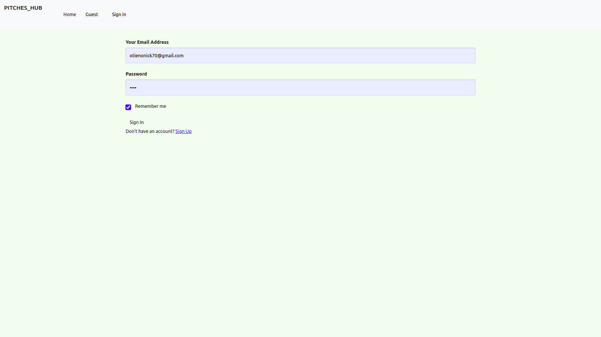

## PITCHES_HUB
### PROJECT DEVELOPER;
 #### Nick Otieno.

### Project Description
#### ***an application that allows users to create pitches,submit their one minute pitches and other users will vote on them and leave comments to give their feedback on them***

### Setup Requirements
    - Github
    - Code Editor
    - Web Browser

### Setup Installation 
    - Fork app from github
    - Clone the app in your terminal using $git clone command
    - Run the code in your code editor  using :
    $ chmod a+x start.py
    $ ./start.sh command

#### Technologies Used;
    - HTML
    - CSS
    - Python
    -Javascript

### LICENCE

#### Email :otienonick70@gmail.com
#### &copy;2021 Nick Otieno.
